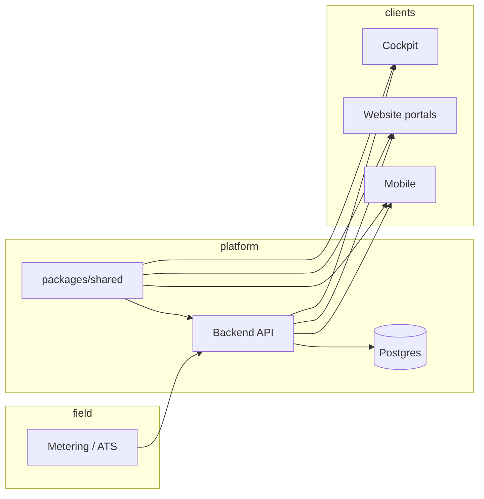

# Architecture

e.mappa is a **prepaid-only, AI-native local energy economy OS** for apartment buildings and single-family homes. Canonical product rules live in [`docs/imported-specs/`](./imported-specs/README.md).

## Monorepo surfaces

| Package | Role |
|---------|------|
| `packages/shared` | Domain types, DRS/LBRS gates, energy, settlement, payback, mock data — **source of truth** |
| `packages/api-client` | Client state + computed projections for demos |
| `backend` | FastAPI API, Postgres, auth, settlement runs |
| `mobile` | Expo native app — one guarded role per install |
| `website` | Public marketing + isolated stakeholder web portals |
| `cockpit` | Internal e.mappa ops: DRS/LBRS, settlement, stress tests |

Stakeholder portals are **role-isolated**. Admin/cockpit is never a public signup role.

## Physical model (apartments)

- Dedicated **e.mappa solar bus** + **Solar DB** — not common-bus injection into the main building bus.
- **Per-apartment ATS** at/near each enrolled unit’s PAYG meter.
- **KPLC/grid fallback** when prepaid e.mappa balance or solar path is unavailable.
- Non-enrolled apartments stay on KPLC only.

Homeowners use **home-level** changeover/ATS, inverter/battery, metering, and export discipline — not apartment-per-unit ATS unless a specific design requires it.

## Readiness gates

| Gate | Question | Authority |
|------|----------|-----------|
| **DRS** | Should installation begin? | `deployment_ready` only when **all critical gates** pass (display score is informational) |
| **LBRS** | Can users safely consume prepaid e.mappa energy now? | Go-live only when **all critical launch tests** pass |

See [DRS_FORMULA.md](./DRS_FORMULA.md) and [LBRS_FORMULA.md](./LBRS_FORMULA.md).

## Economic model

- **E_gen** — operational production (context only).
- **E_sold** — monetized prepaid + delivered kWh (settlement base).
- **E_waste** — no stakeholder payout unless legally exported/traded/credited.
- Settlement waterfall scales down on shortfall — **no debt**.

See [ENERGY_FORMULAS.md](./ENERGY_FORMULAS.md) and [SETTLEMENT_AND_PAYBACK.md](./SETTLEMENT_AND_PAYBACK.md).

## Roles

Public: `resident`, `homeowner`, `building_owner`, `provider`, `financier`, `electrician`.  
Internal: `admin` (cockpit).

`provider` replaces standalone public “supplier” — use `businessType` for panels vs infrastructure vs both.

## Data flow (simplified)

## Source of truth

Product doctrine lives in [docs/imported-specs/](./imported-specs/README.md) (scenarios A–F, the DRS/LBRS/go-live installation spec, and the AI-native system design). Architecture decisions captured here must conform to those specs. Outstanding gaps between code and the imported specs are tracked in [SPEC_COMPLIANCE_CHECKLIST.md](./SPEC_COMPLIANCE_CHECKLIST.md); deployment maturity per environment is tracked in [DEPLOYMENT_AND_READINESS.md](./DEPLOYMENT_AND_READINESS.md).
