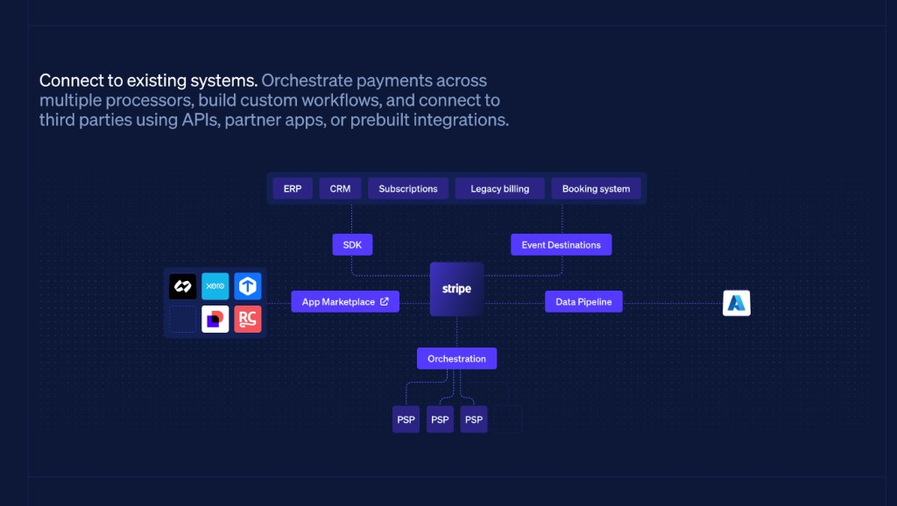
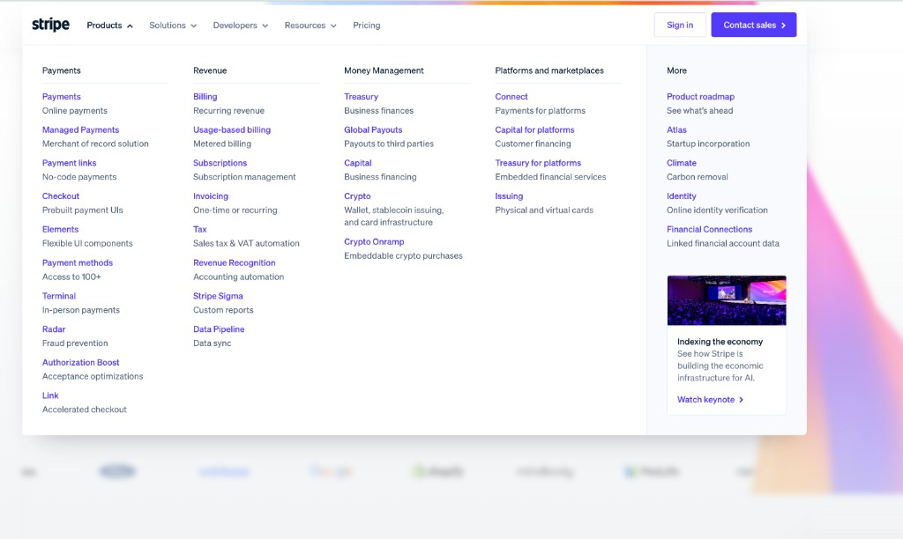
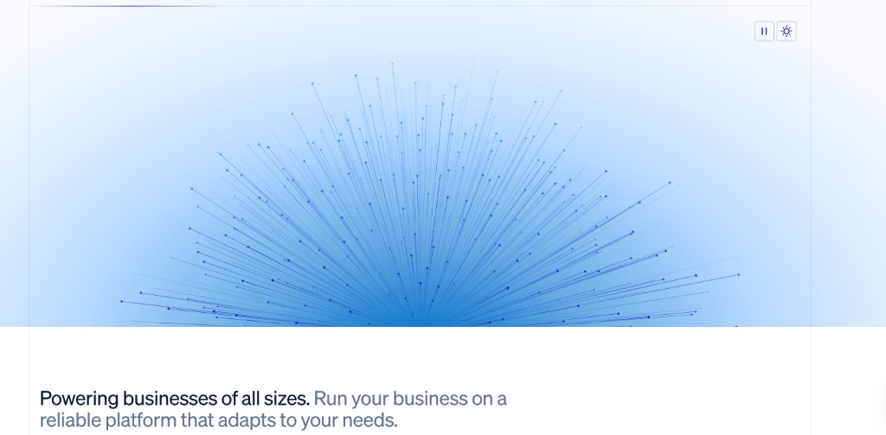
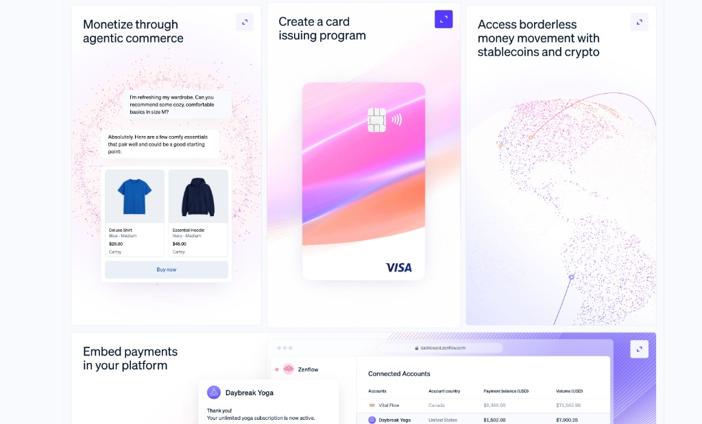
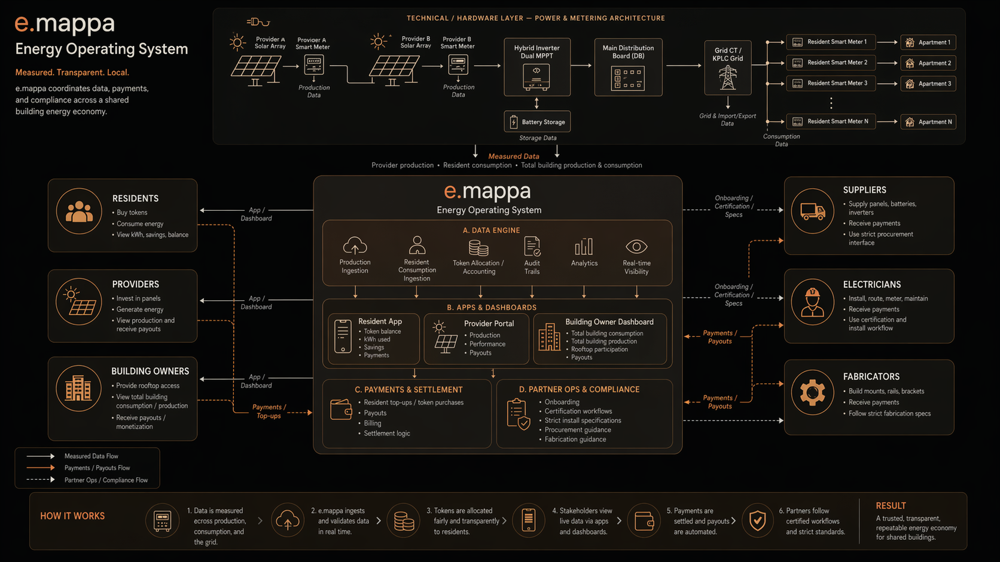
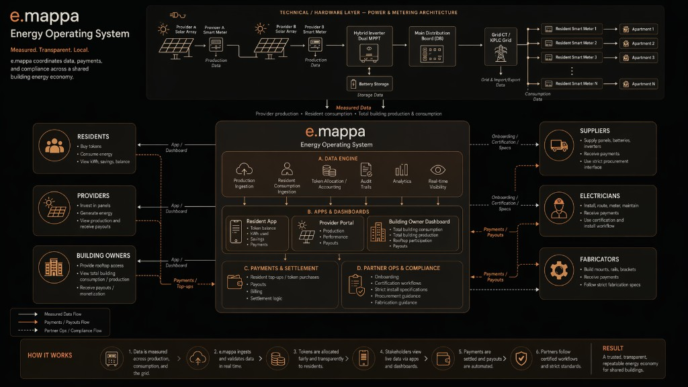
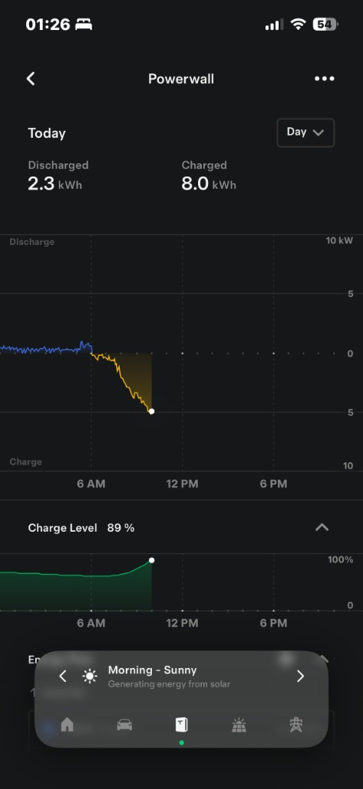
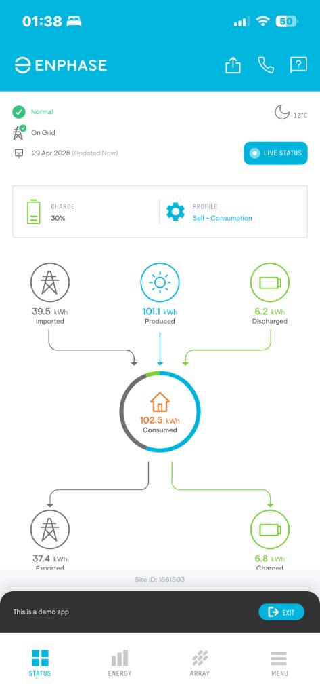
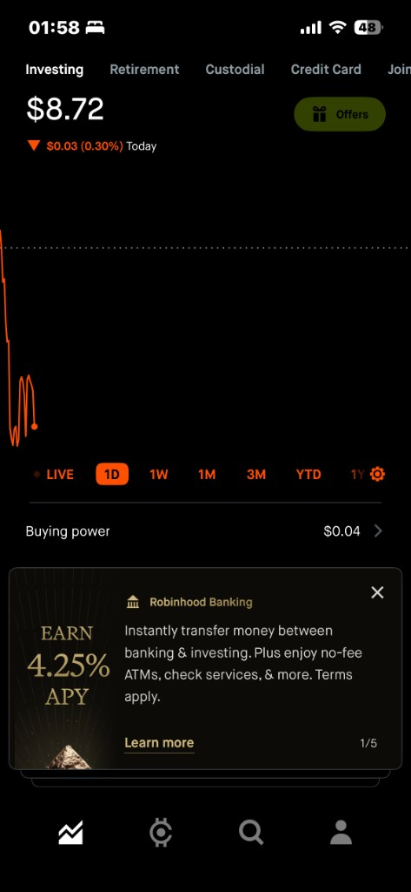

# UI References

These screenshots are the visual north star for e.mappa UI work. Use them before redesigning mobile, website, or cockpit surfaces.

## Reference Images

Official e.mappa palette and character: this is the source of truth for brand warmth, palette, and emotional tone. Use the extracted palette in `OFFICIAL_COLOR_PALETTE.md` and `ui-references/emappa-official-color-palette.json` before choosing colors. The product should feel warm, minimal, soft, trustworthy, and precise.

Stripe reference: light-first dashboard hierarchy, crisp white cards, precise typography, high whitespace, and calm product density. Use the composition, not the Stripe color theme.

Stripe reference: off-white page surfaces, focused form panels, subtle shadows, and clear primary actions.

Stripe reference: metric cards with clean borders, soft gradients, compact labels, and calm financial density.

Stripe reference: operational tables with readable row rhythm, status chips, and low-noise navigation.

e.mappa GPT workflow reference: primary visual north star for the marketing `How it Works` workflow. Use the structure, density, hierarchy, and end-to-end flow language, but translate it into the e.mappa light orange/white palette. Do not make the final website version dark.

e.mappa system reference: relationship graph that explains hardware, data, apps, payments, compliance, and stakeholder cash/data flows without exposing private counterpart finances.

Tesla reference: energy status, sparse controls, large calm numbers, and premium charting adapted into light surfaces.

Enphase reference: solar/grid/home/battery flow clarity and system health communication.

Airbnb reference: warm trust cards, soft spacing, profile credibility, friendly onboarding.

Robinhood reference: finance hierarchy, bold numbers, simple chart controls, and clear action rows adapted without dark default UI.

## e.mappa Translation

- Theme: e.mappa owns its palette. Use the official character palette from `OFFICIAL_COLOR_PALETTE.md`: warm cream, caramel, cocoa, fox orange, rust brown, and espresso detail. Avoid stray Stripe purple/blue, cold grays, or random orange.
- Resident: Stripe light dashboard clarity plus Tesla/Enphase energy flow and Robinhood prepaid balance/ownership upside.
- Owner: Airbnb-style trust/onboarding plus DRS deployment confidence.
- Provider: Robinhood-style asset and payout clarity.
- Financier: deal-room finance clarity without guaranteed returns.
- Installer/Supplier: operational checklists and order status with clean, high-trust cards.
- Internal cockpit: light-first command center, not consumer marketing.
- Marketing `How it Works`: use `emappa-gpt-workflow-reference.png` as the primary visual reference and the e.mappa system relationship map as source material. Build a native light orange/white workflow, not a dark screenshot clone.
